## basicJS && advancedJS

<table>
  <!-- Basic Book(mark) Keeper -->
  <tr>
    <td align="center">
      
      
<strong>Basic Book(mark) Keeper</strong>

    </td>
    <td align="center">
      
      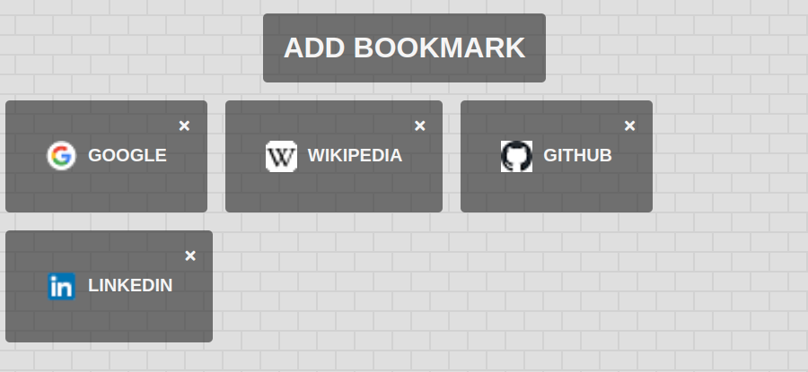
    </td>
  </tr>
  <tr>
    <td align="center">
      
<small>BasicJS</small>

      
      
    </td>
    <td align="center">
      
<small>AdvancedJS</small>

      
      
    </td>
  </tr>

  <!-- Calculator -->
  <tr>
    <td align="center">
      
      
<strong>Calculator</strong>

    </td>
    <td align="center">
      
      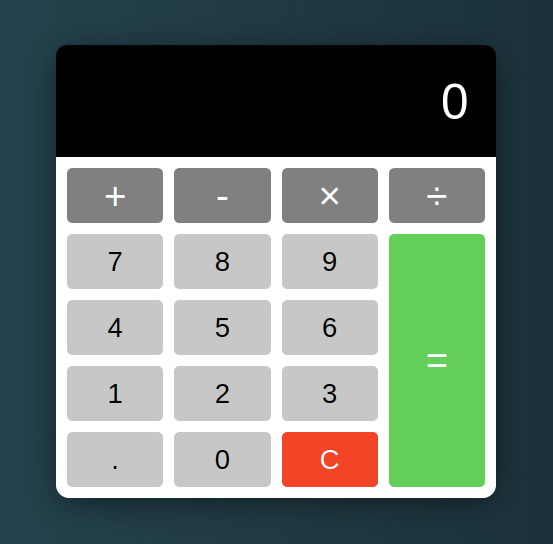
    </td>
  </tr>
  <tr>
    <td align="center">
      
<small>BasicJS</small>

      
      
    </td>
    <td align="center">
      
<small>AdvancedJS</small>

      
      
    </td>
  </tr>

  <!-- Custom Countdown -->
<tr>
  <td align="center">
    
    
<strong>Custom Countdown</strong>

  </td>
  <td align="center">
    
    
  </td>
</tr>
<tr>
  <td align="center">
    
<small>BasicJS</small>

    
    
  </td>
  <td align="center">
    
<small>AdvancedJS</small>

    
    
  </td>
</tr>

<!-- Form Validation -->
<tr>
  <td align="center">
    
    
<strong>Form Validation</strong>

  </td>
  <td align="center">
    
    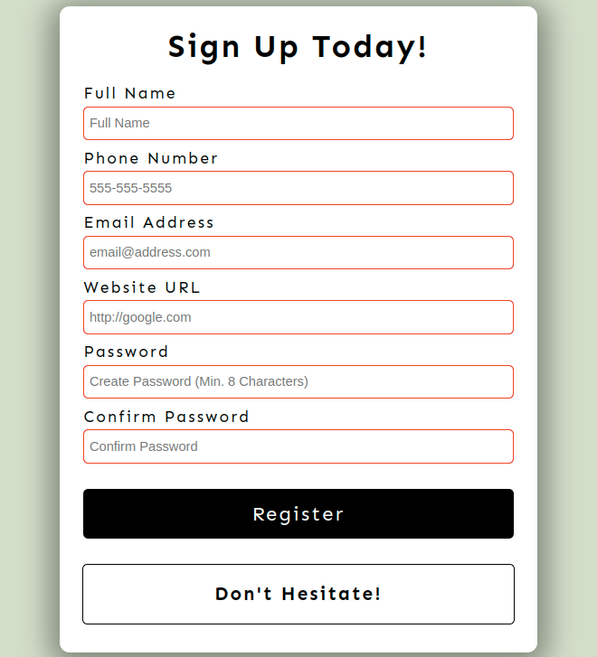
  </td>
</tr>
<tr>
  <td align="center">
    
<small>BasicJS</small>

    
    
  </td>
  <td align="center">
    
<small>AdvancedJS</small>

    
    
  </td>
</tr>

<!-- Infinite Scroll -->
<tr>
  <td align="center">
    
    
<strong>Infinite Scroll</strong>

  </td>
  <td align="center">
    
    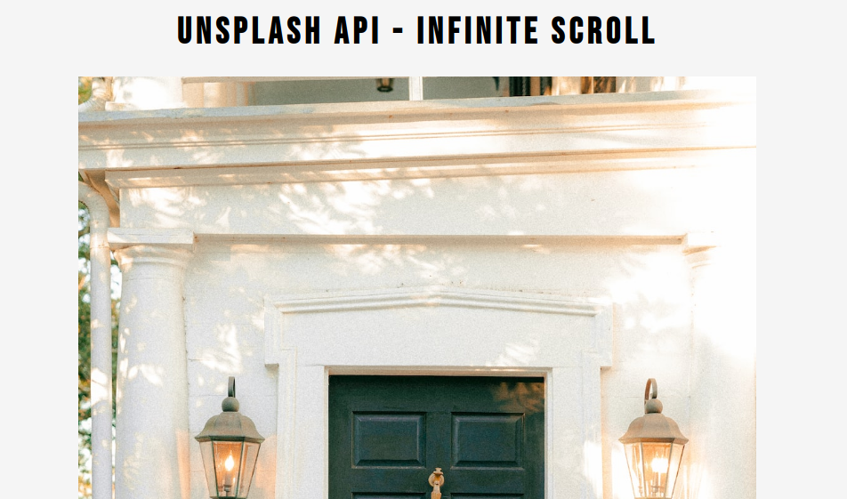
  </td>
</tr>
<tr>
  <td align="center">
    
<small>BasicJS</small>

    
    
  </td>
  <td align="center">
    
<small>AdvancedJS</small>

    
    
  </td>
</tr>

<!-- Joke Teller -->
<tr>
  <td align="center">
    
    
<strong>Joke Teller</strong>

  </td>
  <td align="center">
    
    
  </td>
</tr>
<tr>
  <td align="center">
    
<small>BasicJS</small>

    
    
  </td>
  <td align="center">
    
<small>AdvancedJS</small>

    
    
  </td>
</tr>

<!-- Light/Dark Mode -->
<tr>
  <td align="center">
    
    
<strong>Light/Dark Mode</strong>

  </td>
  <td align="center">
    
    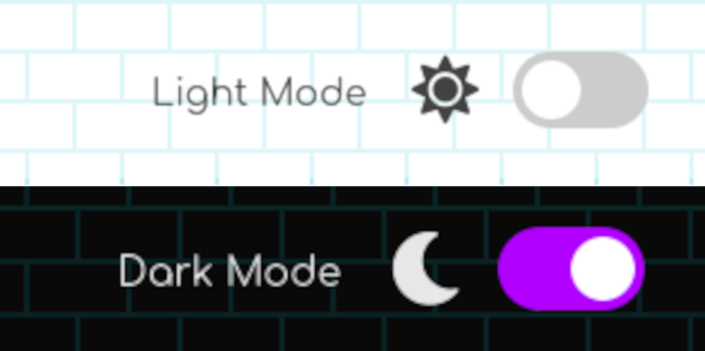
  </td>
</tr>
<tr>
  <td align="center">
    
<small>BasicJS</small>

    
    
  </td>
  <td align="center">
    
<small>AdvancedJS</small>

    
    
  </td>
</tr>

<!-- Math Sprint Game -->
<tr>
  <td align="center"><strong>Math Sprint Game</strong></td>
  <td align="center">
    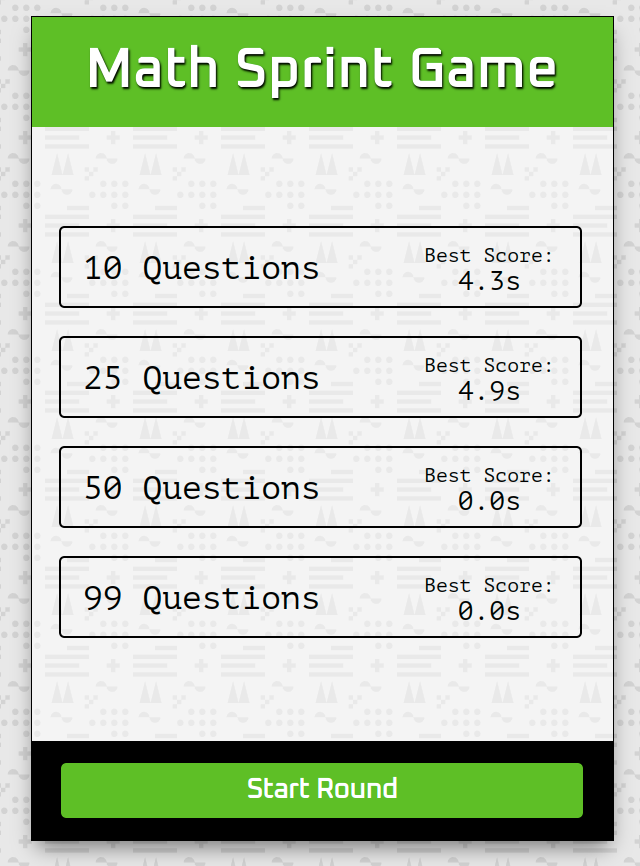
  </td>
</tr>
<tr></tr>
<tr>
  <td align="center">
    
<small>BasicJS</small>

    
    
  </td>
  <td align="center">
    
<small>AdvancedJS</small>

    
    
  </td>
</tr>

<!-- Music Player -->
<tr>
  <td align="center"><strong>Music Player</strong></td>
  <td align="center">
    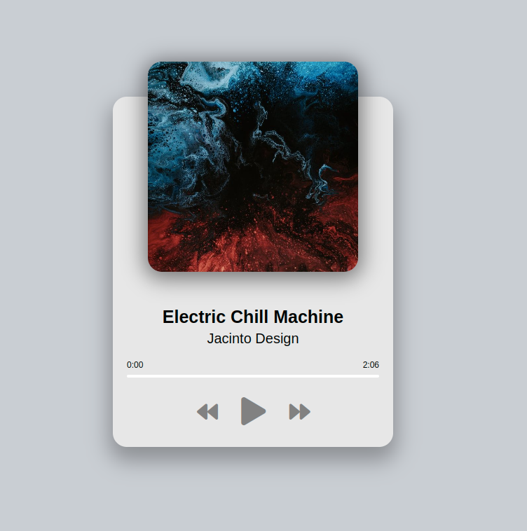
  </td>
</tr>
<tr></tr>
<tr>
  <td align="center">
    
<small>BasicJS</small>

    
    
  </td>
  <td align="center">
    
<small>AdvancedJS</small>

    
    
  </td>
</tr>

<!-- NASA APOD -->
<tr>
  <td align="center"><strong>NASA APOD</strong></td>
  <td align="center">
    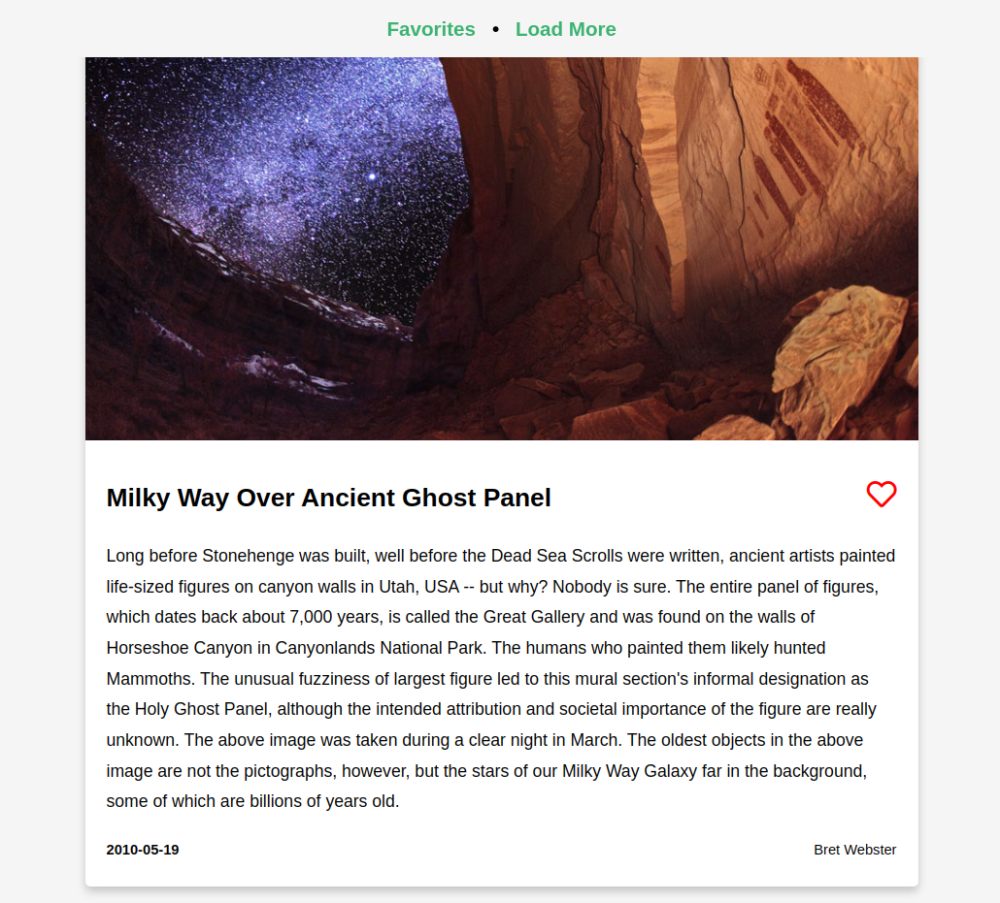
  </td>
</tr>
<tr></tr>
<tr>
  <td align="center">
    
<small>BasicJS</small>

    
    
  </td>
  <td align="center">
    
<small>AdvancedJS</small>

    
    
  </td>
</tr>

<!-- Navigation Nation -->
<tr>
  <td align="center"><strong>Navigation Nation</strong></td>
  <td align="center">
    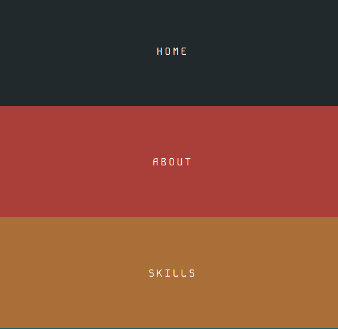
  </td>
</tr>
<tr></tr>
<tr>
  <td align="center">
    
<small>BasicJS</small>

    
    
  </td>
  <td align="center">
    
<small>AdvancedJS</small>

    
    
  </td>
</tr>

<!-- Spock Rock Game -->
<tr>
  <td align="center"><strong>Spock Rock Game</strong></td>
  <td align="center">
    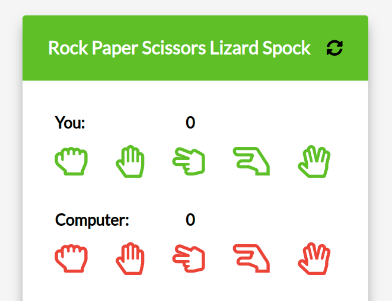
  </td>
</tr>
<tr></tr>
<tr>
  <td align="center">
    
<small>BasicJS</small>

    
    
  </td>
  <td align="center">
    
<small>AdvancedJS</small>

    
    
  </td>
</tr>

<!-- Picture in Picture -->
<tr>
  <td align="center"><strong>Picture in Picture</strong></td>
  <td align="center">
    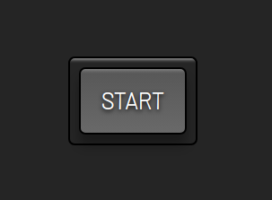
  </td>
</tr>
<tr></tr>
<tr>
  <td align="center">
    
<small>BasicJS</small>

    
    
  </td>
  <td align="center">
    
<small>AdvancedJS</small>

    
    
  </td>
</tr>

<!-- Ping Pong Game -->
<tr>
  <td align="center"><strong>Ping Pong</strong></td>
  <td align="center">
    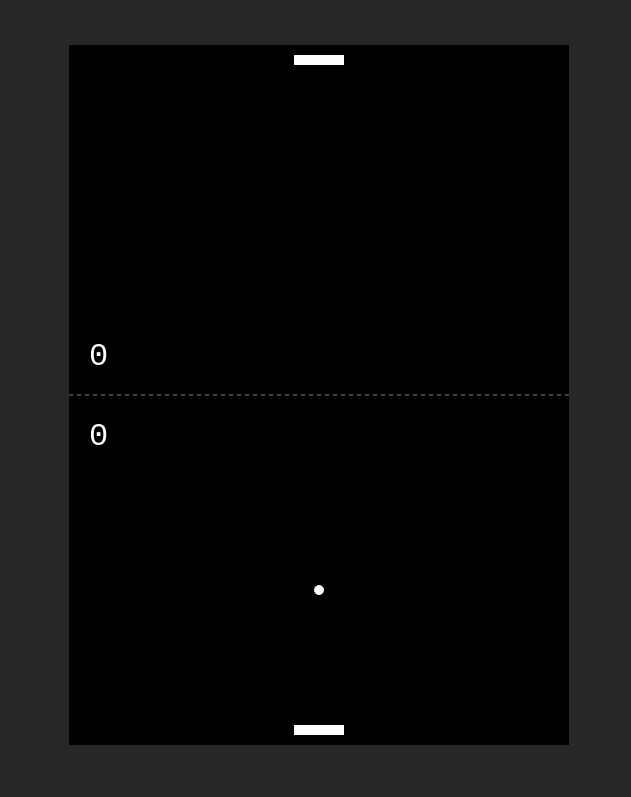
  </td>
</tr>
<tr></tr>
<tr>
  <td align="center">
    
<small>BasicJS</small>

    
    
  </td>
  <td align="center">
    
<small>AdvancedJS</small>

    
    
  </td>
</tr>

<!-- Quote Generator -->
<tr>
  <td align="center"><strong>Quote Generator</strong></td>
  <td align="center">
    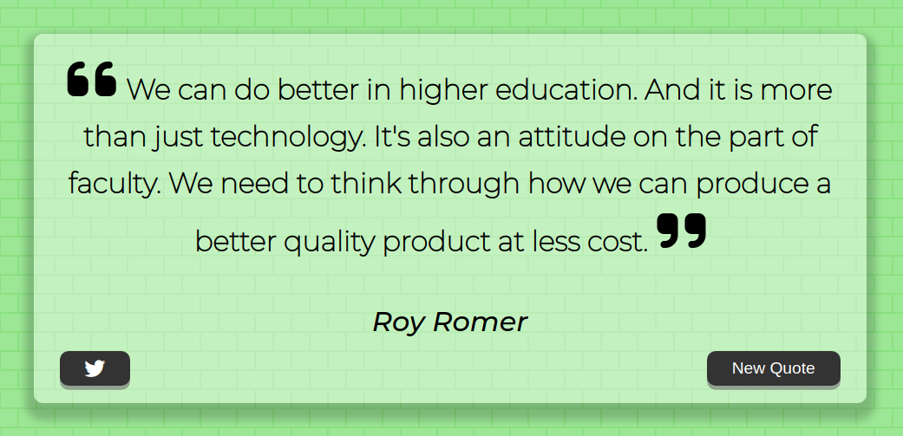
  </td>
</tr>
<tr></tr>
<tr>
  <td align="center">
    
<small>BasicJS</small>

    
    
  </td>
  <td align="center">
    
<small>AdvancedJS</small>

    
    
  </td>
</tr>

<!-- Video Player -->
<tr>
  <td align="center"><strong>Video Player</strong></td>
  <td align="center">
    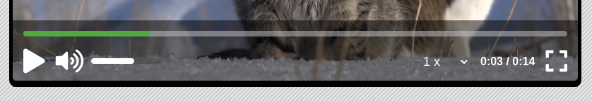
  </td>
</tr>
<tr></tr>
<tr>
  <td align="center">
    
<small>BasicJS</small>

    
    
  </td>
  <td align="center">
    
<small>AdvancedJS</small>

    
    
  </td>
</tr>

</table>
